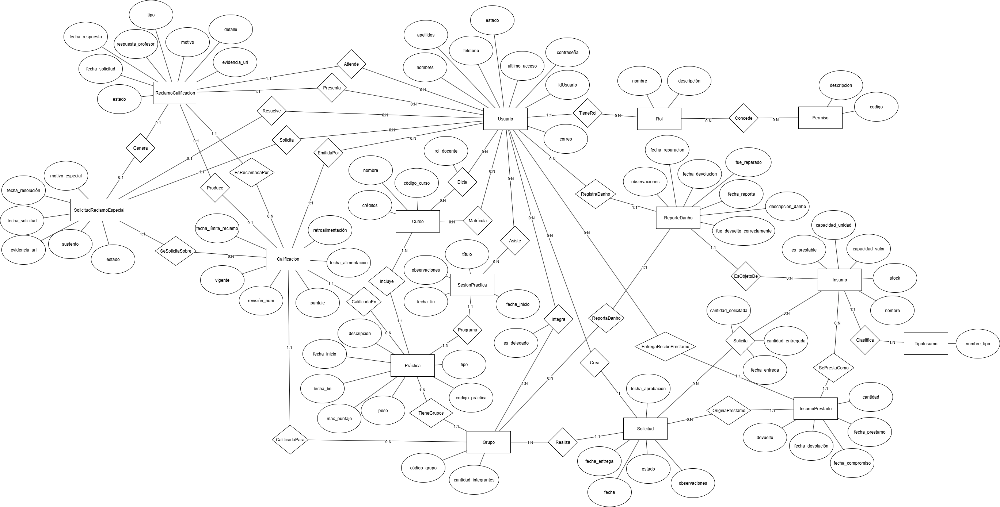

# Módulo Académico–Laboratorio — QuimLab
## Diagrama Entidad–Relación (Conceptual)

  

---

## Diccionario de datos — Entidades

### Entidad: **Usuario**
**Descripción:** Persona que interactúa con el sistema (docentes, alumnos, delegados, coordinadores/administradores).  
**Propósito:** Autenticación, autorización y comunicación; origen/destino de acciones.  
**Reglas de negocio relevantes:**  
- Identificador natural: **correo** (único).  
- `estado` controla la habilitación general (no define permisos).  
- Puede tener **un** Rol (ver relación **TieneRol**).  
- Puede ser **delegado** de un Grupo a través de la relación **Integra** (atributo del vínculo).

| Nombre del atributo | Descripción | Propósito | Dominio | Obligatorio | Único | Multivaluado | Ejemplo |
|---|---|---|---|---|---|---|---|
| correo | Correo institucional | Identificador | Texto (email) | Sí | Sí | No | ricco@uni.edu |
| nombres | Nombres del usuario | Identificación | Texto | Sí | No | No | Ricco |
| apellidos | Apellidos del usuario | Identificación | Texto | Sí | No | No | Rashuaman |
| teléfono | Teléfono de contacto | Contacto | Texto (9–15 dígitos) | No | No | No | 987654321 |
| estado | Habilitación | Control | {Activo, Inactivo, Suspendido} | Sí | No | No | Activo |
| último_acceso | Último ingreso | Auditoría | FechaHora | No | No | No | 2025-10-22 14:35 |
| contraseña | Credencial de acceso | Seguridad | Texto (hash) | Sí | No | No | — |
| foto_url | Foto de perfil | Usabilidad | URL | No | No | No | https://…/foto.jpg |
| tema_preferido | Preferencia UI | Usabilidad | {light, dark} | No | No | No | dark |

---

### Entidad: **Rol**
**Descripción:** Perfil funcional (Administrador, Coordinador, Profesor, Alumno).  
**Propósito:** Control de autorización por asignación de permisos.  
**Reglas de negocio relevantes:**  
- Identificador natural: **nombre** (único).  
- Un Rol **concede** 0..N Permisos (relación **Concede**).  
- Un Usuario **tiene** exactamente 1 Rol (relación **TieneRol**).

| Nombre del atributo | Descripción | Propósito | Dominio | Obligatorio | Único | Multivaluado | Ejemplo |
|---|---|---|---|---|---|---|---|
| nombre | Nombre del rol | Identificador | Texto | Sí | Sí | No | Profesor |
| descripción | Observaciones del rol | Contexto | Texto | No | No | No | Puede calificar |

---

### Entidad: **Permiso**
**Descripción:** Capacidad atómica (p.ej., CALIFICAR, REVISAR_RECLAMO, APROBAR_ESPECIAL).  
**Propósito:** Granularidad de autorización.  
**Reglas de negocio relevantes:**  
- Identificador natural: **código** (único).  
- Se **asigna** a Roles por relación **Concede**.

| Nombre del atributo | Descripción | Propósito | Dominio | Obligatorio | Único | Multivaluado | Ejemplo |
|---|---|---|---|---|---|---|---|
| código | Código del permiso | Identificador | Texto | Sí | Sí | No | CALIFICAR |
| descripción | Descripción del permiso | Contexto | Texto | No | No | No | Registrar notas |

---

### Entidad: **Curso**
**Descripción:** Unidad académica (asignatura).  
**Propósito:** Agrupar prácticas, profesores y alumnos.  
**Reglas de negocio relevantes:**  
- Identificador natural: **código_curso** (único); `nombre` único a nivel académico.  
- Un Curso **incluye** 0..N Prácticas (relación **Incluye**).  
- Profesores y alumnos se vinculan vía relaciones **Dicta** y **Matricula**.

| Nombre del atributo | Descripción | Propósito | Dominio | Obligatorio | Único | Multivaluado | Ejemplo |
|---|---|---|---|---|---|---|---|
| código_curso | Código legible | Identificador | Texto | Sí | Sí | No | QLAB-101 |
| nombre | Nombre del curso | Identificación | Texto | Sí | Sí | No | Química de Laboratorio |
| créditos | Créditos académicos | Carga | Entero (≥0) | Sí | No | No | 3 |

---

### Entidad: **Practica**
**Descripción:** Actividad evaluable del curso (laboratorio/actividad).  
**Propósito:** Soporte a calificación, grupos, asistencia e inventario.  
**Reglas de negocio relevantes:**  
- Identificador natural: **código_práctica**.  
- `fecha_fin ≥ fecha_inicio`.  
- Tiene `max_puntaje` y `peso` (para promedio ponderado).  
- Una Práctica **tiene** 0..N Grupos (relación **TieneGrupos**).  
- Una Práctica **programa** 0..N Sesiones (relación **Programa**).

| Nombre del atributo | Descripción | Propósito | Dominio | Obligatorio | Único | Multivaluado | Ejemplo |
|---|---|---|---|---|---|---|---|
| código_práctica | Código legible | Identificador | Texto | Sí | Sí | No | PRA-01 |
| tipo | Tipo de práctica | Clasificación | Texto / Enum | Sí | No | No | laboratorio |
| descripción | Resumen | Contexto | Texto | No | No | No | Valoración de pH |
| fecha_inicio | Inicio de vigencia | Calendario | Fecha | Sí | No | No | 2025-03-10 |
| fecha_fin | Fin de vigencia | Calendario | Fecha | Sí | No | No | 2025-03-20 |
| max_puntaje | Puntaje máximo | Evaluación | Número (≥0) | Sí | No | No | 20 |
| peso | Peso relativo | Evaluación | Número (≥0) | Sí | No | No | 0.25 |

---

### Entidad: **Grupo**
**Descripción:** Equipo de alumnos para una práctica.  
**Propósito:** Unidades de evaluación, solicitudes y reportes.  
**Reglas de negocio relevantes:**  
- Identificador natural: **código_grupo**.  
- `cantidad_integrantes > 0`.  
- **Integra** a 1..N Usuarios; **máximo 1** delegado por Grupo (atributo del vínculo en **Integra**).

| Nombre del atributo | Descripción | Propósito | Dominio | Obligatorio | Único | Multivaluado | Ejemplo |
|---|---|---|---|---|---|---|---|
| código_grupo | Identificador del equipo | Identificador | Texto | Sí | Sí | No | G-01 |
| cantidad_integrantes | Tamaño del grupo | Control | Entero (>0) | Sí | No | No | 4 |

---

### Entidad: **TipoInsumo**
**Descripción:** Categoría del insumo (vidrio, reactivo, equipo).  
**Propósito:** Clasificación de inventario.  
**Reglas de negocio relevantes:**  
- Identificador natural: **nombre_tipo** (único).  
- Clasifica 0..N Insumos (relación **Clasifica**).

| Nombre del atributo | Descripción | Propósito | Dominio | Obligatorio | Único | Multivaluado | Ejemplo |
|---|---|---|---|---|---|---|---|
| nombre_tipo | Nombre de la categoría | Identificador | Texto | Sí | Sí | No | Reactivo |

---

### Entidad: **Insumo**
**Descripción:** Material/equipo administrado por el laboratorio.  
**Propósito:** Soporte a solicitudes, préstamos y reportes de daño.  
**Reglas de negocio relevantes:**  
- `stock ≥ 0`; `capacidad_valor ≥ 0` si existe.  
- `es_prestable` define si puede ser prestado (préstamos).  
- Se vincula a Tipo vía **Clasifica**.

| Nombre del atributo | Descripción | Propósito | Dominio | Obligatorio | Único | Multivaluado | Ejemplo |
|---|---|---|---|---|---|---|---|
| nombre | Nombre del insumo | Identificación | Texto | Sí | No | No | Bureta 50ml |
| stock | Stock disponible | Control | Entero (≥0) | Sí | No | No | 12 |
| capacidad_valor | Capacidad numérica | Descriptivo | Decimal (≥0) | No | No | No | 50.0 |
| capacidad_unidad | Unidad (ml, g, etc.) | Descriptivo | Texto | No | No | No | ml |
| es_prestable | ¿Se presta? | Política | Booleano | Sí | No | No | true |

---

### Entidad: **Solicitud** (de insumos)
**Descripción:** Pedido de insumos por un Grupo.  
**Propósito:** Orquestar aprobación, preparación, entrega y cierre.  
**Reglas de negocio relevantes:**  
- Ciclo de estados: PENDIENTE→APROBADA→PREPARADA→ENTREGADA→(CERRADA/RECHAZADA).  
- Ítems solicitados se modelan en relación **Solicita** (Solicitud–Insumo) con atributos del vínculo.  
- Produce 0..N **InsumoPrestado**.

| Nombre del atributo | Descripción | Propósito | Dominio | Obligatorio | Único | Multivaluado | Ejemplo |
|---|---|---|---|---|---|---|---|
| fecha | Fecha de la solicitud | Trazabilidad | Fecha | Sí | No | No | 2025-04-01 |
| estado | Estado del flujo | Control | {PENDIENTE, APROBADA, PREPARADA, ENTREGADA, RECHAZADA, CERRADA} | Sí | No | No | APROBADA |
| observaciones | Comentarios | Contexto | Texto | No | No | No | Urgente |
| fecha_aprobación | Momento de aprobación | Control | FechaHora | No | No | No | 2025-04-01 10:00 |
| fecha_entrega | Momento de entrega | Control | FechaHora | No | No | No | 2025-04-02 08:30 |

---

### Entidad: **InsumoPrestado** (Préstamo)
**Descripción:** Ejecución de un préstamo (sobre uno de los ítems solicitados).  
**Propósito:** Control de cantidades y devoluciones.  
**Reglas de negocio relevantes:**  
- `cantidad > 0`; si `devuelto = true` ⇒ `fecha_devolución` informada.  
- Se asocia a **Solicitud** y **Insumo** por relaciones (ver abajo).  
- Intervienen usuarios: **entregado_por** y **receptor** (relaciones con Usuario).

| Nombre del atributo | Descripción | Propósito | Dominio | Obligatorio | Único | Multivaluado | Ejemplo |
|---|---|---|---|---|---|---|---|
| cantidad | Cantidad prestada | Control | Entero (>0) | Sí | No | No | 2 |
| fecha_prestamo | Momento del préstamo | Trazabilidad | Fecha | Sí | No | No | 2025-04-02 |
| fecha_compromiso | Compromiso de devolución | Control | Fecha | No | No | No | 2025-04-09 |
| fecha_devolución | Momento de la devolución | Trazabilidad | Fecha | No | No | No | 2025-04-08 |
| devuelto | ¿Fue devuelto? | Control | Booleano | Sí | No | No | false |

---

### Entidad: **ReporteDanho** (Reporte de Daño)
**Descripción:** Registro de daño/avería/incidencia sobre un insumo durante una práctica.  
**Propósito:** Trazabilidad técnica y administrativa.  
**Reglas de negocio relevantes:**  
- Fechas consistentes: `fecha_devolución ≥ fecha_reporte`, `fecha_reparación ≥ fecha_reporte`.  
- Puede registrarse devolución correcta y reparación.

| Nombre del atributo | Descripción | Propósito | Dominio | Obligatorio | Único | Multivaluado | Ejemplo |
|---|---|---|---|---|---|---|---|
| fecha_reporte | Fecha del reporte | Trazabilidad | Fecha | Sí | No | No | 2025-04-03 |
| descripción_daño | Detalle del daño | Contexto | Texto | Sí | No | No | Vidrio roto |
| fue_devuelto_correctamente | Devolución conforme | Control | Booleano | Sí | No | No | false |
| fue_reparado | ¿Se reparó? | Control | Booleano | Sí | No | No | false |
| fecha_devolución | Fecha de devolución | Trazabilidad | Fecha | No | No | No | 2025-04-05 |
| fecha_reparación | Fecha de reparación | Trazabilidad | Fecha | No | No | No | — |
| observaciones | Notas | Contexto | Texto | No | No | No | — |

---

### Entidad: **Calificacion**
**Descripción:** Resultado evaluativo del Grupo en la Práctica.  
**Propósito:** Historial de versiones (revisiones) con una **vigente**.  
**Reglas de negocio relevantes:**  
- `0 ≤ puntaje ≤ max_puntaje` (de la Práctica).  
- Por par (Práctica, Grupo): **historial** pero **solo 1 vigente**.  
- Profesor emisor vía relación **EmitidaPor**.

| Nombre del atributo | Descripción | Propósito | Dominio | Obligatorio | Único | Multivaluado | Ejemplo |
|---|---|---|---|---|---|---|---|
| puntaje | Nota numérica | Evaluación | Número (≥0) | Sí | No | No | 18 |
| retroalimentación | Comentarios del profesor | Contexto | Texto | No | No | No | Revisar sección 2 |
| fecha_calificación | Momento de registro | Trazabilidad | Fecha | Sí | No | No | 2025-04-10 |
| revisión_num | Versión de la nota | Historial | Entero (≥1) | Sí | No | No | 1 |
| vigente | Marca de vigencia | Control | Booleano | Sí | No | No | true |
| fecha_límite_reclamo | Límite para reclamo | Política | Fecha | No | No | No | 2025-04-13 |

---

### Entidad: **ReclamoCalificacion**
**Descripción:** Impugnación presentada por el **delegado** sobre una Calificación.  
**Propósito:** Gestionar revisión (normal) con decisión del profesor.  
**Reglas de negocio relevantes:**  
- `tipo ∈ {NORMAL, ESPECIAL}`; en “ESPECIAL” se activa por **SolicitudReclamoEspecial** aprobada.  
- Estados: REGISTRADO→EN_REVISION→(ACEPTADO/RECHAZADO)→CERRADO.  
- Aceptado puede **producir** nueva Calificación.

| Nombre del atributo | Descripción | Propósito | Dominio | Obligatorio | Único | Multivaluado | Ejemplo |
|---|---|---|---|---|---|---|---|
| tipo | Tipo de reclamo | Clasificación | {NORMAL, ESPECIAL} | Sí | No | No | NORMAL |
| motivo | Razón principal | Contexto | Texto | Sí | No | No | Error en suma |
| detalle | Detalle ampliado | Contexto | Texto | No | No | No | — |
| evidencia_url | Evidencia adjunta | Soporte | URL | No | No | No | https://…/informe.pdf |
| estado | Estado del reclamo | Control | {REGISTRADO, EN_REVISION, ACEPTADO, RECHAZADO, CERRADO} | Sí | No | No | EN_REVISION |
| fecha_solicitud | Registro del reclamo | Trazabilidad | Fecha | Sí | No | No | 2025-04-11 |
| fecha_respuesta | Decisión del profesor | Trazabilidad | Fecha | No | No | No | 2025-04-12 |
| respuesta_profesor | Comentario de decisión | Contexto | Texto | No | No | No | Se recalifica a 19 |

---

### Entidad: **SolicitudReclamoEspecial**
**Descripción:** Petición **excepcional** del delegado al **coordinador/administrador** para una **última** revisión.  
**Propósito:** Separar la **autorización previa** del proceso de reclamo especial.  
**Reglas de negocio relevantes:**  
- Estados: REGISTRADA / APROBADA / RECHAZADA / CADUCADA.  
- **A lo sumo 1** solicitud especial **pendiente** por calificación.  
- Al aprobarse, **genera** un ReclamoCalificacion (tipo ESPECIAL).

| Nombre del atributo | Descripción | Propósito | Dominio | Obligatorio | Único | Multivaluado | Ejemplo |
|---|---|---|---|---|---|---|---|
| motivo_especial | Motivo de la excepción | Contexto | Texto | Sí | No | No | Error en rúbrica |
| sustento | Argumento detallado | Contexto | Texto | No | No | No | — |
| evidencia_url | Evidencia | Soporte | URL | No | No | No | https://… |
| estado | Estado de la solicitud | Control | {REGISTRADA, APROBADA, RECHAZADA, CADUCADA} | Sí | No | No | REGISTRADA |
| fecha_solicitud | Registro | Trazabilidad | Fecha | Sí | No | No | 2025-04-12 |
| fecha_resolución | Decisión | Trazabilidad | Fecha | No | No | No | 2025-04-13 |

---

### Entidad: **SesionPractica**
**Descripción:** Sesión programada de una práctica (todas **presenciales** por regla).  
**Propósito:** Origen de marcaciones de asistencia.  
**Reglas de negocio relevantes:**  
- `fecha_fin ≥ fecha_inicio`.  
- Los asistentes se marcan por relación **Asiste** (con atributos del vínculo).

| Nombre del atributo | Descripción | Propósito | Dominio | Obligatorio | Único | Multivaluado | Ejemplo |
|---|---|---|---|---|---|---|---|
| título | Título de la sesión | Identificación | Texto | Sí | No | No | Laboratorio #1 |
| fecha_inicio | Inicio | Calendario | FechaHora | Sí | No | No | 2025-04-15 08:00 |
| fecha_fin | Fin | Calendario | FechaHora | Sí | No | No | 2025-04-15 10:00 |
| observaciones | Notas | Contexto | Texto | No | No | No | Traer bata |

---

## Relaciones 

> Notación de cardinalidad: **(mín..máx)** junto a cada entidad.

### Seguridad / Acceso
1. **TieneRol**  
   - Participantes: **Usuario** (1..1) — **Rol** (0..N)  
   - Atributos del vínculo: —  
   - Restricción: cada Usuario tiene **exactamente 1** Rol.

2. **Concede**  
   - Participantes: **Rol** (0..N) — **Permiso** (0..N)  
   - Atributos del vínculo: —  
   - Nota: si se requiere vigencia o alcance, podrían añadirse atributos (conceptualmente opcionales).

---

### Académico
3. **Incluye**  
   - Participantes: **Curso** (0..N) — **Practica** (1..1)  
   - Atributos del vínculo: —  

4. **Dicta** *(solo profesores)*  
   - Participantes: **Usuario** (0..N) — **Curso** (0..N)  
   - Atributos del vínculo: `rol_docente`  
   - Restricción: `Usuario` debe tener Rol compatible (Profesor/Asistente/Coordinador).

5. **Matricula** *(solo alumnos)*  
   - Participantes: **Usuario** (0..N) — **Curso** (0..N)  
   - Atributos del vínculo: —  
   - Restricción: `Usuario` con Rol compatible (Alumno).

6. **TieneGrupos**  
   - Participantes: **Practica** (0..N) — **Grupo** (1..1)  
   - Atributos del vínculo: —  

7. **Integra**  
   - Participantes: **Grupo** (1..N) — **Usuario** (0..N)  
   - Atributos del vínculo: `es_delegado` (Booleano)  
   - Restricción: **a lo sumo 1** `es_delegado = true` por **Grupo**.

---

### Evaluación (notas y reclamos)
8. **CalificadaEn**  
   - Participantes: **Practica** (0..N) — **Calificacion** (1..1)  
   - Atributos del vínculo: —  

9. **CalificadaPara**  
   - Participantes: **Grupo** (0..N) — **Calificacion** (1..1)  
   - Atributos del vínculo: —  
   - Restricción global: por par (**Practica**, **Grupo**) hay **historial** de Calificaciones pero **solo 1** con `vigente = true`.

10. **EmitidaPor** *(profesor que califica)*  
    - Participantes: **Usuario** (0..N) — **Calificacion** (1..1)  
    - Atributos del vínculo: —  
    - Restricción: `Usuario` con permiso **CALIFICAR**.

11. **EsReclamadaPor**  
    - Participantes: **Calificacion** (0..N) — **ReclamoCalificacion** (1..1)  
    - Atributos del vínculo: —  

12. **Presenta** *(delegado)*  
    - Participantes: **Usuario** (0..N) — **ReclamoCalificacion** (1..1)  
    - Atributos del vínculo: —  
    - Restricción: `Usuario` debe ser **delegado** del **Grupo** asociado a la Calificación (subconjunto de **Integra** con `es_delegado = true`).

13. **Atiende** *(profesor destino)*  
    - Participantes: **Usuario** (0..N) — **ReclamoCalificacion** (1..1)  
    - Atributos del vínculo: —  
    - Restricción: `Usuario` con permiso **REVISAR_RECLAMO**.

14. **Produce** *(si ACEPTADO, opcional)*  
    - Participantes: **ReclamoCalificacion** (0..1) — **Calificacion** (0..1)  
    - Atributos del vínculo: —  
    - Justificación: si el reclamo es ACEPTADO, se crea una nueva Calificación.

15. **SeSolicitaSobre**  
    - Participantes: **Calificacion** (0..N) — **SolicitudReclamoEspecial** (1..1)  
    - Atributos del vínculo: —  
    - Restricción: solo procede si hubo **primera revisión** (`revisión_num ≥ 2`).

16. **Solicita** *(delegado)*  
    - Participantes: **Usuario** (0..N) — **SolicitudReclamoEspecial** (1..1)  
    - Atributos del vínculo: —  
    - Restricción: `Usuario` debe ser **delegado** del Grupo de la Calificación.

17. **Resuelve** *(coordinador/administrador)*  
    - Participantes: **Usuario** (0..N) — **SolicitudReclamoEspecial** (0..1)  
    - Atributos del vínculo: —  
    - Restricción: `Usuario` con Rol en {Administrador, Coordinador} o con permiso **APROBAR_ESPECIAL**.

18. **Genera** *(si APROBADA)*  
    - Participantes: **SolicitudReclamoEspecial** (0..1) — **ReclamoCalificacion** (0..1)  
    - Atributos del vínculo: —  

---

### Laboratorio / Inventario
19. **Clasifica**  
    - Participantes: **TipoInsumo** (0..N) — **Insumo** (1..1)  
    - Atributos del vínculo: —  

20. **Realiza**  
    - Participantes: **Grupo** (0..N) — **Solicitud** (1..1)  
    - Atributos del vínculo: —  

21. **Solicita** *(ítems de solicitud)*  
    - Participantes: **Solicitud** (0..N) — **Insumo** (0..N)  
    - **Atributos del vínculo**:  
      - `cantidad_solicitada` (Entero > 0)  
      - `cantidad_entregada` (Entero ≥ 0, opcional)  
      - `fecha_entrega` (FechaHora, opcional)  
    - Nota: si quisieras modelar responsables de entrega/recepción como atributos del vínculo, se documentan como **roles** con Usuario en el modelo lógico.

22. **OriginaPrestamo**  
    - Participantes: **Solicitud** (0..N) — **InsumoPrestado** (1..1)  
    - Atributos del vínculo: —  

23. **SePrestaComo**  
    - Participantes: **Insumo** (0..N) — **InsumoPrestado** (1..1)  
    - Atributos del vínculo: —  

24. **EntregaPrestamo** *(entregado_por)*  
    - Participantes: **Usuario** (0..N) — **InsumoPrestado** (1..1)  
    - Atributos del vínculo: —  
    - Restricción: `Usuario` con permiso **ENTREGAR_INSUMOS**.

25. **RecibePrestamo** *(receptor)*  
    - Participantes: **Usuario** (0..N) — **InsumoPrestado** (1..1)  
    - Atributos del vínculo: —  

26. **ReportaDanho**  
    - Participantes: **Grupo** (0..N) — **ReporteDanho** (1..1)  
    - Atributos del vínculo: —  

27. **EsObjetoDe**  
    - Participantes: **Insumo** (0..N) — **ReporteDanho** (1..1)  
    - Atributos del vínculo: —  

28. **RegistraDanho**  
    - Participantes: **Usuario** (0..N) — **ReporteDanho** (1..1)  
    - Atributos del vínculo: —  

---

### Asistencia
29. **Programa**  
    - Participantes: **Practica** (0..N) — **SesionPractica** (1..1)  
    - Atributos del vínculo: —  

30. **Asiste**  
    - Participantes: **Usuario** (0..N) — **SesionPractica** (0..N)  
    - **Atributos del vínculo**:  
      - `estado` ∈ {PRESENTE, TARDE, AUSENTE}  
      - `timestamp` (FechaHora)  
    - Restricción: **a lo sumo 1** marcación vigente por (Usuario, Sesión).

---
